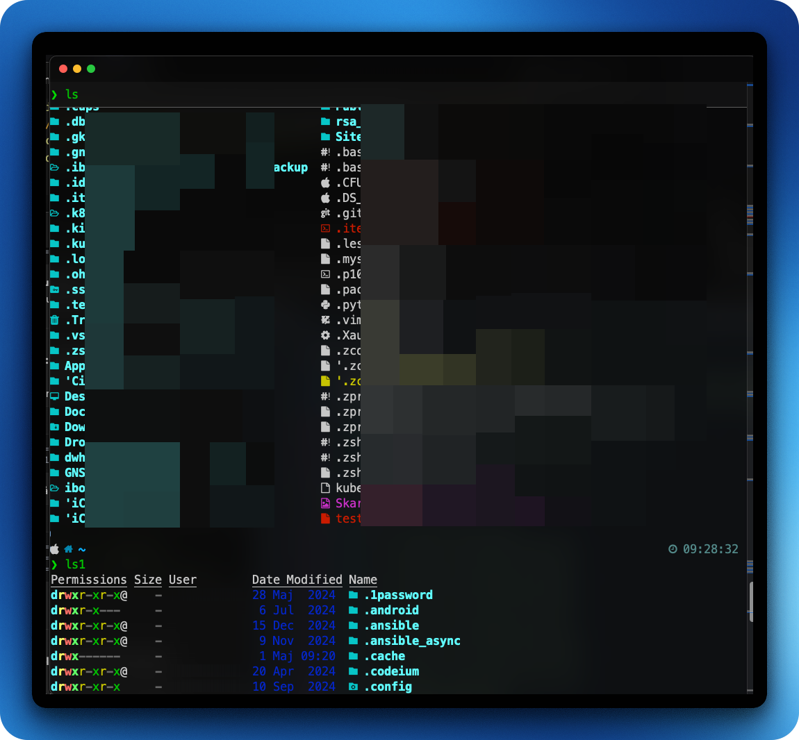

# Terminal Styling

Your terminal will look amazing.

## Custom Oh My ZHS configuration with:

- Fast, interactive prompt via Oh My ZSH (theme: powerlevel10k)

- Intelligent auto‑completion for Git, Composer, SSH, and more

- Command correction (misspelled commands are auto‑fixed)

- Directory jumping with zoxide (z alias)

- Enhanced cat output using batcat

- Git shortcuts & bashmarks plugin for marking favorite directories

- Optional case‑/hyphen‑sensitive completion settings

- Asynchronous shell editing (BLE) for a smoother experience

- Custom aliases (ls, ls1, etc.) and plugin loading

- Configurable update checks, colors, titles, history timestamps, etc.

## To auto install the plastic surgery of your ZHS shell please run:

### ⚠️ Dont use sudo ⚠️ ⚠️ Dont use sudo ⚠️ ⚠️ Dont use sudo ⚠️ ⚠️ Dont use sudo ⚠️ ⚠️ Dont use sudo ⚠️ ⚠️ Dont use sudo ⚠️ ⚠️ Dont use sudo ⚠️ ⚠️ Dont use sudo ⚠️ ⚠️ Dont use sudo ⚠️ ⚠️ Dont use sudo ⚠️

### If you dont have git installed you will get a prompt asking you to install command line developer tools. 
### Accept the prompt ###

```bash
cd ~ && bash -c "$(curl -fsSL https://raw.githubusercontent.com/blitzes27/macos/main/terminal_plastic_surgery/mac_auto_install.sh)"
```
**Don’t forget to source your .zshrc file: COMMAND = source ~/.zshrc**

**To be able to see icons in your terminal you need to select NERD FONTS. do so by:**

### If you use Terminal app
* **Terminal -> Settings -> Profile -> Text -> Change "@Font" -> Choose any of the Meslo  fonts i like MesloLGS NF**

### If you use iTerm2 app
* **iTerm2 -> Preferences -> Profiles -> Text -> Change Font -> Choose any of the Meslo  fonts i like MesloLGS NF**
